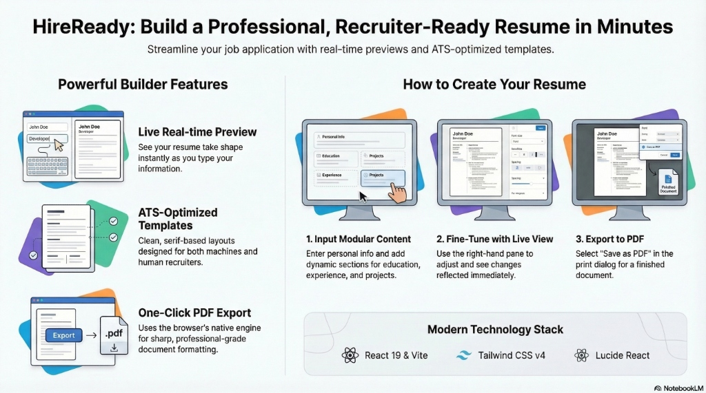

# 🚀 HireReady: Professional Resume Builder



**HireReady** is a modern, fast, and intuitive resume builder designed to help job seekers create professional, recruiter-ready resumes in minutes. With real-time preview and one-click PDF export, HireReady removes the friction from document formatting so you can focus on your content.

---

## 📹 Video Demonstration

<video src="https://github.com/Prisans/hire-ready/raw/main/public/assets/video/HireReady.mp4" controls width="100%"></video>

*(Watch HireReady in action!)*

---

## ✨ Key Features

- **Live Real-time Preview**: See your resume take shape as you type. No more guessing how your data fits on the page.
- **Modern A4 Template**: A clean, professional serif-based layout optimized for ATS and human readability.
- **Dynamic Content Sections**: Add or remove Work Experience, Education, and Projects easily. Sections only appear in the preview if they contain data.
- **High-Quality PDF Export**: Download your resume as a professional-grade PDF with sharp text and perfect formatting using the browser's native print engine.
- **Responsive Interface**: A sleek, two-pane builder layout designed with **Tailwind CSS v4** for a premium look and feel.

---

## 🛠️ Tech Stack

- **Frontend**: [React 19](https://react.dev/)
- **Build Tool**: [Vite](https://vitejs.dev/)
- **Styling**: [Tailwind CSS v4](https://tailwindcss.com/)
- **State Management**: React **Context API** (Modular architecture for Personal Info, Education, Experience, Projects, and Skills)
- **PDF Generation**: [react-to-print](https://github.com/MatthewHerbst/react-to-print)
- **Icons**: [Lucide React](https://lucide.dev/)

---

## 🚀 Getting Started

Follow these steps to get the project running locally:

### 1. Clone the repository
```bash
git clone https://github.com/Prisans/hire-ready.git
cd hire-ready
```

### 2. Install dependencies
```bash
npm install
```

### 3. Run the development server
```bash
npm run dev
```
Open [http://localhost:5173](http://localhost:5173) in your browser to see the app in action!

---

## 📖 How It Works

1.  **Personal Information**: Start by entering your name, contact details, and a professional summary.
2.  **Modular Sections**: Use the interactive accordion to add your **Education**, **Experience**, and **Projects**.
3.  **Skills**: List your technical and soft skills to highlight your expertise.
4.  **Live Adjustments**: The right-hand pane instantly reflects your changes, allowing you to fine-tune your resume's look.
5.  **Export**: Once satisfied, hit the **Export** button. Select **"Save as PDF"** in the print dialog to download your professional resume.

---

## 🔮 Roadmap & Future Features

We are constantly working to make **HireReady** even better!

- **🤖 AI Resume Refiner (Coming Soon)**: An integrated AI feature that will analyze your resume content and provide suggestions to make it more impactful and ATS-friendly.
- **Custom Templates**: Multiple professional designs to choose from.
- **Theming**: Dark mode support and custom color accents.
- **Cloud Sync**: Save your progress and access your resumes from anywhere.

---

## 🤝 Contributing

Contributions are welcome! If you have any suggestions or find a bug, feel free to open an issue or submit a pull request.

---

## 📄 License

This project is licensed under the MIT License.

---

*Built with ❤️ for Acciojobs*
